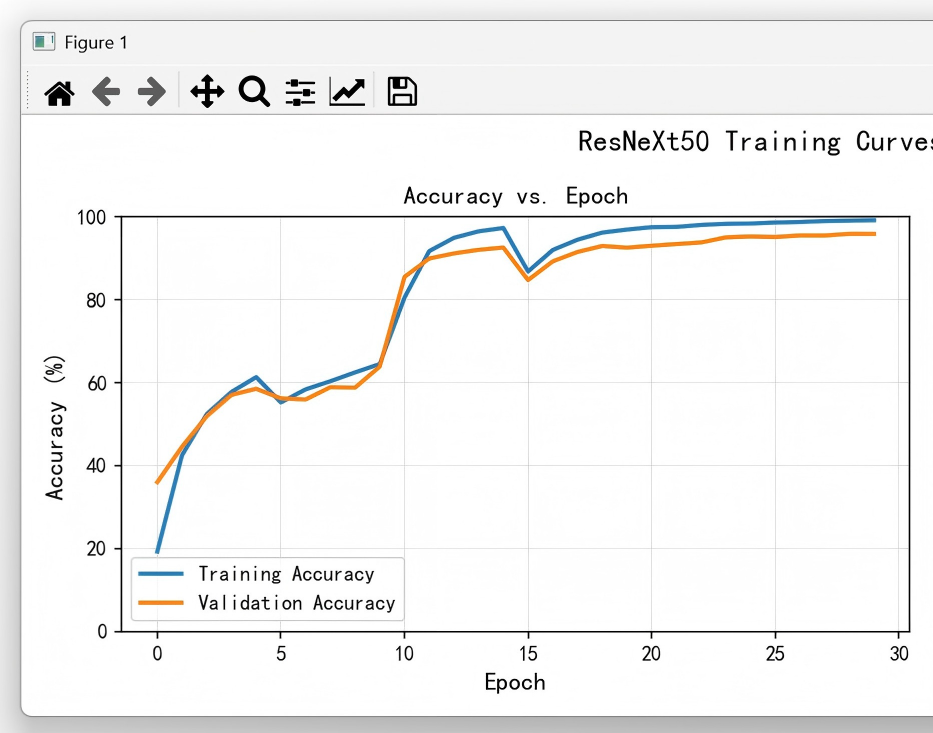
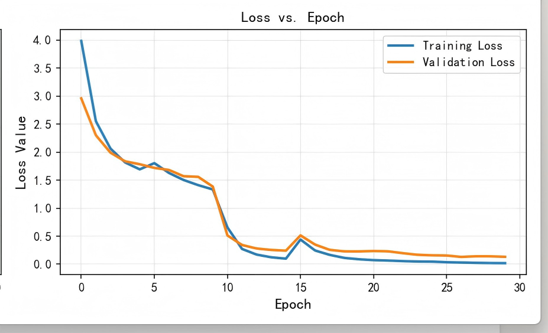

# Fine-grained-Leaf-Classification-System-Based-on-ResNeXt50-Transfer-Learning
基于ResNext50迁移学习的树叶细粒度分类系统
## 项目简介
针对植物物种识别中树叶类内差异小、类间差异大的痛点，构建基于深度学习的树叶细粒度分类系统，实现高精度物种识别。对比自研残差网络与迁移学习模型的性能差异。通过数据增强、模型微调、分层学习率、余弦退火调度等策略，完成从数据加载、模型训练、验证评估到测试集预测的全流程闭环。项目验证了迁移学习在细粒度分类任务上的显著优势，验证集准确率从87.67%提升至95.89%，具备稳定、高效、高泛化能力的实际应用价值。

## 核心技术栈
- 开发语言：Python
- 深度学习框架：PyTorch、TorchVision
- 数据处理：：Pandas、NumPy、PIL
- 数据增强：随机水平翻转、随机旋转、随机裁剪、归一化
- 模型结构：自定义ResNet、预训练ResNeXt50
- 训练策略：迁移学习、冻结微调、分层学习率、权重衰减
- 优化器：AdamW
- 学习率调度：CosineAnnealingWarmRestarts
- 评估指标：Top-1 分类准确率
- 可视化：Matplotlib 训练曲线绘制

## 核心功能
1. 支持树叶数据集自动加载、训练集 / 验证集划分
2. 自定义Dataset与DataLoader批量高效读取
3. 多类型数据增强提升模型泛化能力
4. 自定义ResNet残差网络从零训练
5. 基于ImageNet预训练权重的ResNeXt50迁移学习
6. 分阶段冻结微调，保护预训练特征
7. 训练过程实时日志输出、最优模型保存
8. 训练损失与准确率曲线自动绘制与保存
9. 测试集自动预测并生成提交文件

## 运行环境
- Python 3.8~3.11
- PyTorch ≥1.12
- 支持GPU/CPU运行

## 依赖安装
pip install -r requirements.txt

## 运行方式
1. 将数据集 images、train.csv、test.csv 放入./data/目录
2. 安装依赖
3. 运行模型训练
python resnet.py #自定义 ResNet 模型
python resnext.py #ResNeXt50 迁移学习模型

## 注意事项
1. 首次运行会自动下载 ResNeXt50 预训练权重
2. 如显存不足，可适当调小BATCH_SIZE
3. 数据集路径必须正确，否则无法加载图像
4. 训练好的最优模型会自动保存为 resnet_best.pth/resnext_best.pth

## 🌄训练曲线

准确率曲线

准确率曲线

